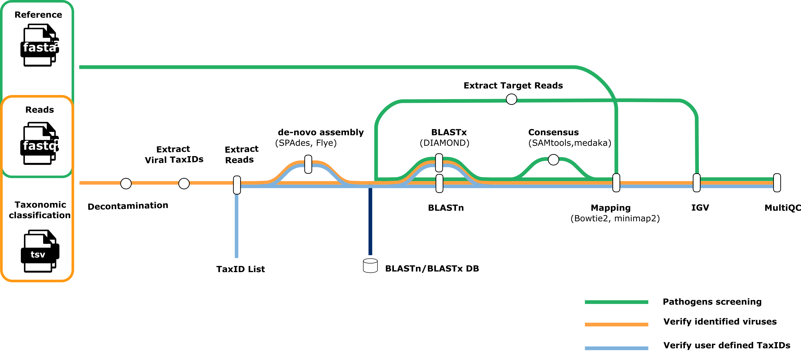

# genomic-medicine-sweden/metaval

[](https://github.com/genomic-medicine-sweden/metaval/actions/workflows/ci.yml)
[](https://github.com/genomic-medicine-sweden/metaval/actions/workflows/linting.yml)[](https://doi.org/10.5281/zenodo.XXXXXXX)
[](https://www.nf-test.com)

[](https://www.nextflow.io/)
[](https://docs.conda.io/en/latest/)
[](https://www.docker.com/)
[](https://sylabs.io/docs/)
[](https://cloud.seqera.io/launch?pipeline=https://github.com/genomic-medicine-sweden/metaval)

## Introduction

**genomic-medicine-sweden/meta-val** is a bioinformatics pipeline for post-processing of [nf-core/taxprofiler](https://github.com/nf-core/taxprofiler) results. It verifies the species classified by the nf-core/taxprofiler pipeline using Nanopore and Illumina shotgun metagenomic data. At the moment, `genomic-medicine-sweden/meta-val` only verifies the classification results from three taxonomic classifiers `Kraken2`, `Centrifuge` and `diamond`.

The pipeline, constructed using the `nf-core` [template](https://nf-co.re/tools#creating-a-new-pipeline), utilizing Docker/Singularity containers for easy installation and reproducible results. The implementation follows [Nextflow DSL2](https://www.nextflow.io/docs/latest/dsl1.html), employing one container per process for simplified maintenance and dependency management. Processes are sourced from [nf-core/modules](https://github.com/nf-core/modules) for broader accessibility within the Nextflow community.

## Pipeline summary

<p align="center">
     
</p>

### Green Workflow - Pathogen Screening

This workflow is activated by enabling the `--perform_screen_pathogens` option.

1. **Map reads to pathogen genomes**

   - Map reads to a predefined list of viral pathogen genomes using [Bowtie2](http://bowtie-bio.sourceforge.net/bowtie2/) for Illumina reads or [minimap2](https://github.com/lh3/minimap2) for Nanopore reads. This step checks for the presence of known pathogens in the sample.

2. **Call consensus**

   - This step generates consensus sequences for a large number of reads mapped to pathogen genomes using [samtools](<(http://www.htslib.org/)>) for Illumina reads or [medaka](https://github.com/nanoporetech/medaka) for Nanopore reads. The resulting consensus sequence will then be used as input for BLAST.

3. **BLAST for pathogen identification**

   - Use `BLAST` to identify the closest reference genomes for the target reads. There are two options: `BLASTx` using [DIAMOND](https://github.com/bbuchfink/diamond) based on the protein database, and [BLASTn](https://blast.ncbi.nlm.nih.gov/Blast.cgi) based on the nucleotide database.

4. **Extract target reads**

   - From the mapped reads, extract the target reads that match the predefined viral pathogens based on the result of `BLAST`.

5. **Visualisation using IGV**

   - Visualize the extracted reads using `IGV` (Integrative Genomics Viewer) to provide a graphical representation for detailed analysis.

6. **Perform quality check**
   - Conduct quality checks on the target reads using [FastQC](https://www.bioinformatics.babraham.ac.uk/projects/fastqc/) and [MultiQC](<(http://multiqc.info/)>) to ensure data quality and reliability.

### Orange Workflow - Verify Identified Viruses

This workflow is activated by enabling the `--perform_extract_reads` option and disabling the `--taxid`.

1. **Decontamination**

   - Filter the output files from metagenomics classifiers like [Kraken2](https://ccb.jhu.edu/software/kraken2/), [Centrifuge](https://ccb.jhu.edu/software/centrifuge/), or [DIAMOND](https://github.com/bbuchfink/diamond) to remove false positives and background contaminations. This step compares results to the negative control and identifies likely present species based on user-defined thresholds.

2. **Extract viral TaxIDs**

   - Extract **_viral_** TaxIDs predicted by taxonomic classification tools such as `Kraken2`, `Centrifuge`, and `DIAMOND`.

3. **Extract reads**

   - Extract the reads classified as viruses based on a list of identified TaxIDs.

4. **de-novo assembly**

   - This step performs de novo assembly for TaxIDs with a number of reads exceeding `params.min_read_counts`. [Spades](https://github.com/ablab/spades) is used for Illumina reads, and [Flye](https://github.com/mikolmogorov/Flye) is used for Nanopore reads. The resulting contig files will be used as input for `BLAST`.

5. **BLAST**

   - Use `BLAST` to identify the closest reference genomes for the target reads. There are two options: `BLASTx` using [DIAMOND](https://github.com/bbuchfink/diamond) based on the protein database, and [BLASTn](https://github.com/bbuchfink/diamond) based on the nucleotide database.

6. **Mapping**

   - Map the reads of TaxIDs to the closest reference genomes identified by `BLAST`. Use [Bowtie2](<(http://bowtie-bio.sourceforge.net/bowtie2/)>) for Illumina reads and [minimap2](https://github.com/lh3/minimap2) for Nanopore reads.

7. **Visualisation using IGV**

   - Visualize the mapped reads using `IGV`.

8. **Perform quality check**
   - Conduct quality checks on the classified reads using [FastQC](<(https://www.bioinformatics.babraham.ac.uk/projects/fastqc/)>) and [MultiQC](<(http://multiqc.info/)>) to ensure the accuracy of the data.

## Blue Workflow - Verify User-Defined TaxIDs

This workflow is activated by enabling the `--perform_extract_reads` option and the `--taxid` option, allowing users to define a list of TaxIDs. It is not limited to `viral` TaxIDs and can include `bacteria`, `fungi`, `archaea`, `parasites`, or `plasmids`.

All steps are the same as the **Orange Workflow** except using user-defined TaxIDs instead of extracting predefined viral TaxIDs.

## Usage

> [!NOTE]
> If you are new to Nextflow and nf-core, please refer to [this page](https://nf-co.re/docs/usage/installation) on how to set-up Nextflow. Make sure to [test your setup](https://nf-co.re/docs/usage/introduction#how-to-run-a-pipeline) with `-profile test` before running the workflow on actual data.

<!-- TODO nf-core: Describe the minimum required steps to execute the pipeline, e.g. how to prepare samplesheets.
     Explain what rows and columns represent. For instance (please edit as appropriate):

First, prepare a samplesheet with your input data that looks as follows:

`samplesheet.csv`:

```csv
sample,fastq_1,fastq_2
CONTROL_REP1,AEG588A1_S1_L002_R1_001.fastq.gz,AEG588A1_S1_L002_R2_001.fastq.gz
```

Each row represents a fastq file (single-end) or a pair of fastq files (paired end).

-->

Now, you can run the pipeline using:

<!-- TODO nf-core: update the following command to include all required parameters for a minimal example -->

```bash
nextflow run genomic-medicine-sweden/metaval \
   -profile <docker/singularity/.../institute> \
   --input samplesheet.csv \
   --outdir <OUTDIR>
   --perform_extract_reads --extract_kraken2_reads
```

> [!WARNING]
> Please provide pipeline parameters via the CLI or Nextflow `-params-file` option. Custom config files including those provided by the `-c` Nextflow option can be used to provide any configuration _**except for parameters**_; see [docs](https://nf-co.re/docs/usage/getting_started/configuration#custom-configuration-files).

## Credits

genomic-medicine-sweden/meta-val was originally written by [LilyAnderssonLee](https://github.com/LilyAnderssonLee).All PRs were reviewed by [sofstam](https://github.com/sofstam), with additional contributions from [lokeshbio](https://github.com/lokeshbio).

We thank the following people for their extensive assistance in the development of this pipeline:

<!-- TODO nf-core: If applicable, make list of people who have also contributed -->

## Contributions and Support

If you would like to contribute to this pipeline, please see the [contributing guidelines](.github/CONTRIBUTING.md).

## Citations

<!-- TODO nf-core: Add citation for pipeline after first release. Uncomment lines below and update Zenodo doi and badge at the top of this file. -->
<!-- If you use genomic-medicine-sweden/metaval for your analysis, please cite it using the following doi: [10.5281/zenodo.XXXXXX](https://doi.org/10.5281/zenodo.XXXXXX) -->

<!-- TODO nf-core: Add bibliography of tools and data used in your pipeline -->

An extensive list of references for the tools used by the pipeline can be found in the [`CITATIONS.md`](CITATIONS.md) file.

This pipeline uses code and infrastructure developed and maintained by the [nf-core](https://nf-co.re) community, reused here under the [MIT license](https://github.com/nf-core/tools/blob/main/LICENSE).

> **The nf-core framework for community-curated bioinformatics pipelines.**
>
> Philip Ewels, Alexander Peltzer, Sven Fillinger, Harshil Patel, Johannes Alneberg, Andreas Wilm, Maxime Ulysse Garcia, Paolo Di Tommaso & Sven Nahnsen.
>
> _Nat Biotechnol._ 2020 Feb 13. doi: [10.1038/s41587-020-0439-x](https://dx.doi.org/10.1038/s41587-020-0439-x).
